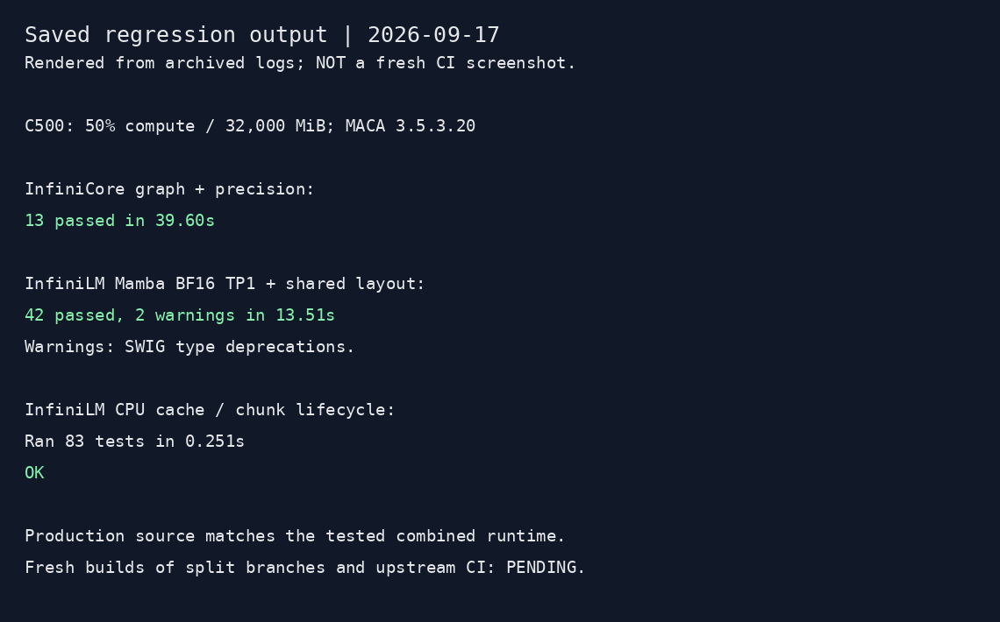

# Mamba-2 and cache/chunk PR validation evidence

Saved results from 2026-09-17. This evidence-only fork branch is **not proposed for merge** into the implementation PRs. Machine paths and connection information are excluded. The image below renders saved test output; it is not a screenshot of a fresh CI run.



## Current retained regressions

| Suite | Result | Conditions |
|---|---|---|
| InfiniCore cat, reduction/scalar graph replay and MetaX precision | 13 passed in 39.60 s | C500 TP1; cat 6, reduction/scalar 5, process-isolated precision 2 |
| InfiniLM Mamba and shared pretranspose regression | 42 passed in 13.51 s; two SWIG deprecation warnings | C500, 130M, BF16 TP1; eager Prefill and existing Decode graphs |
| InfiniLM cache and chunk lifecycle | 83 passed in 0.251 s | CPU; retained configuration, cache ownership and scheduling regressions |

Read the adjacent `.log` files for saved output and `provenance.json` for source identifiers and artifact hashes. The 83-test run exercises expected rejection/failure paths; their diagnostics do not indicate test failures. The retained Mamba suite uses 16 Decode steps with recapture at step 8 and 12 service cycles. These are short regressions, not a new soak test.

The same production source had previously passed NVIDIA A6000 TP1/TP2 FP32/FP16/BF16 model checks; C500 FP32/FP16/BF16 eager/graph checks; 54 scan output/state cases per device; and descriptor negative tests. Those matrices were not repeated during test cleanup. Prior service validation completed 64/64 requests and four streaming disconnects. The evaluation adapter ran five MMLU abstract-algebra samples, scoring **0/5**: entrypoint execution only, not a passing quality result. Prior fixed WikiText checks used 8 passages / 4099 prediction targets: C500 BF16 NLL 3.14331950 versus archived official NVIDIA BF16 3.13971278. This is not universal logit equivalence or a broad quality evaluation.

## Device and model

- One C500 slice: 50% compute, 32,000 MiB quota, six CPU cores. C500 TP2 is not validated.
- MACA 3.5.3.20, driver 3.8.30, PyTorch 2.8.0+metax3.5.3.9, Python 3.10.10.
- Checkpoint `state-spaces/mamba2-130m@3a5aea0c25d0fb43cc360e2c2aac82c26e3eed49`.
- Tokenizer `EleutherAI/gpt-neox-20b@c292233c833e336628618a88a648727eb3dff0a7`.
- Core build: `metax-gpu=y use-mc=y aten=y ccl=y graph=y cpu=y nv-gpu=n cudnn=n ninetoothed=n use-vendor-ops=n`; LM `cxx11-abi=1`.
- BF16 activations; FP32 residuals and recurrent state. About 18.25 MiB recurrent state per request for this model at TP1, independent of history length. This is not total process/graph peak memory.

## Archived performance comparison

Both modes use eager Prefill and the same Mamba runtime. Fixed token IDs, greedy output of 128 tokens per request, 16 Decode warmup tokens, three repeats. Values below are medians of per-run measurements. Wall time runs through CPU availability of each token and excludes tokenization, loading and graph capture. Output rate includes Prefill and equals all output tokens / finite request duration. It is **not sustained serving throughput**.

| Input / batch | TTFT eager -> graph (ms) | Mean ITL eager -> graph (ms) | Output rate eager -> graph (token/s) |
|---|---:|---:|---:|
| 128 / 1 | 18.33 -> 18.02 | 12.54 -> 7.67 | 79.48 -> 128.95 |
| 2048 / 1 | 133.14 -> 132.87 | 12.59 -> 7.68 | 73.87 -> 115.60 |
| 512 / 4 | 127.84 -> 126.77 | 8.26 -> 3.61 | 434.94 -> 875.32 |

Per-run values and output hashes are in `benchmark-eager.json` and `benchmark-graph.json`. Each scenario has identical generated-token hashes across its six runs. These archived measurements were not rerun when splitting the PRs; they measure reuse of the existing Decode graphs, not a new Prefill compiler or superiority to other frameworks. Official NVIDIA graph inference was faster in the archived A6000 comparison. Capture cost and full graph/process peak memory are not quantified here; device free-memory readings are not process peaks.

## Reproduction and limitations

Build the three Core implementation branches together with the LM model branch listed in `provenance.json`; prepare the checkpoint using the model PR's README. For strict FP32, set `INFINIOP_METAX_ALLOW_TF32=0` before process startup. The same production source was built and tested in a combined runtime; a fresh isolated build of each split branch and upstream CI remain pending. Formatting and whitespace checks passed locally, including the LM repository's `scripts/format.py --check --ref` against the requested base.

Current suite commands, from the appropriate repository and configured runtime:

```sh
python -m pytest test/infinicore/graph/test_cat.py test/infinicore/graph/test_sum_scalar_power.py test/infinicore/ops/test_metax_gemm_precision.py -q
python -m pytest test/models/mamba2 test/layers/test_pre_transpose.py -q
```

Use `INFINILM_MAMBA2_MODEL` for the prepared model and the device/dtype/graph environment options documented in the retained tests. The standalone operator matrix was not rerun in this cleanup. No Ascend/Moore backend, PP, hybrid SSM/Attention, quantization, scheduler chunked Prefill, prefix-state snapshots or remote state transfer is claimed for this Mamba adaptation.
