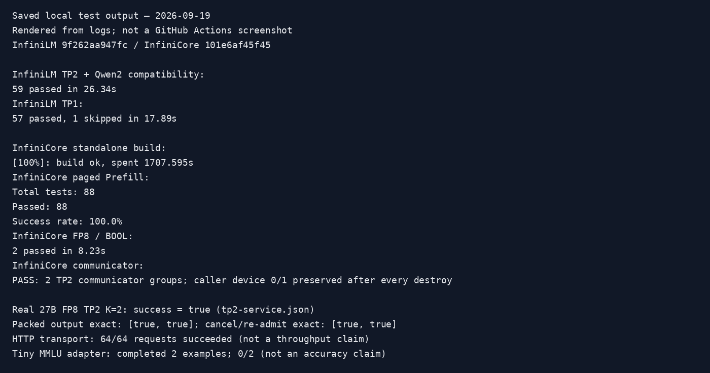

# Qwen MTP final review evidence — 2026-09-19

Source commits: InfiniLM `9f262aa947fc26ceae780facdcfeadddc2f36a17`; InfiniCore `101e6af45f45e02c8bd83465805394fa2c90a56b`.
Targets: `InfiniLM-v0.2.9c`, bases LM `270feb3e`, Core `1ab85ef1`.
This documentation-only fork branch is deliberately outside both feature PR diffs.
Local paths, process IDs and GPU UUIDs are redacted; timings/assertions are retained.

## Environment and dependencies

2 x NVIDIA RTX A6000 48 GiB (SM86), PCIe/no NVLink, driver 580.105.08.
Python 3.11.15, PyTorch 2.9.0+cu128; native compilation CUDA Toolkit 12.4.
Loaded CUDA/NCCL libraries came from the PyTorch environment (NCCL 2.27.5).
Core options: release, NVIDIA, ATen, CCL, graph, OpenMP, cuDNN, SM86.
The Core PR built in a fresh directory in 1707.595 s. Its operator/C API checks
loaded libraries from its separate installation, confirmed with `ldd`.
LM built from the target-based submission branch in a fresh directory, then
rebuilt after final review. LM graph integration used the combined development
Core runtime including graph recording/lifetime PR #1560. The standalone Core
PR does not include #1560 and does not depend on Mamba scan PR #1562.

## Current validation

| Check | Result |
|---|---|
| LM tiny Qwen TP2 + ordinary Qwen2 pre-transpose | 59 passed in 26.34 s |
| LM tiny Qwen TP1 | 57 passed, 1 TP2-only test skipped |
| Real 27B FP8 TP2 K=2 service lifecycle | Exact output; packed verification, cancel/re-admit, close/reclaim passed |
| Single inference and offline benchmark CLI | Passed; benchmark page size 32, input 63/output 8 |
| MMLU benchmark adapter, tiny random fixture | Completed 2 examples, score 0/2; plumbing smoke only |
| HTTP service + project `scripts/test_perf.py` | 64/64 requests succeeded, 20 clients, server max batch 2 |
| Core paged Prefill on standalone PR runtime | 88/88 cases, FP16/BF16 and int32/int64 metadata |
| Core finite E4M3 and BOOL casts | 2 passed, exact comparison |
| Core communicator destroy | Two TP2 groups, current device 0 and 1 preserved |
| Formatting | Project script, clang-format 21.1.8, Ruff 0.15.20; no whitespace errors |

Tiny fixture uses FP8 E4M3 block weights with BF16 activations and FP32 recurrent
states, hidden size 256, 2 target layers (GDN/full attention), 1 MTP layer.
Configuration and SHA256 manifest are included; no model weights are published.
Qwen2 compatibility regression creates synthetic weights on CPU but executes
model inference on NVIDIA. It does not validate CPU model inference.
GPU MTP tests skip without `INFINILM_QWEN_MTP_TEST_MODEL`; full supported tests
were run with it set. Core NCCL standalone check is included as an evidence script.

## Commands

Set `PYTHONPATH` to the respective PR source package and `LD_LIBRARY_PATH` to
its matching installed runtime. Initialize pinned submodules before building.

```bash
# InfiniCore (with the matching PyTorch/CUDA development environment)
xmake f -m release --nv-gpu=y --aten=y --ccl=y --graph=y --omp=y \
  --cuda=/usr/local/cuda-12.4 --cuda_arch=sm_86 --cudnn=y \
  --cuflags=-Xcompiler=-Wno-error=attributes -y
xmake -j4 _infinicore
python test/infinicore/ops/paged_attention_prefill.py --nvidia
python -m pytest -q test/infinicore/ops/fp8_cast.py
python check_comm_device.py

# InfiniLM
xmake f -m release -y
xmake -j4 _infinilm
CUDA_VISIBLE_DEVICES=0,1 INFINILM_QWEN_MTP_TEST_MODEL=/models/tiny-qwen-mtp \
  INFINILM_QWEN_MTP_TEST_TP=2 python -m pytest -q \
  test/models/qwen3_5 test/layers/test_pre_transpose.py
CUDA_VISIBLE_DEVICES=1 INFINILM_QWEN_MTP_TEST_MODEL=/models/tiny-qwen-mtp \
  INFINILM_QWEN_MTP_TEST_TP=1 python -m pytest -q test/models/qwen3_5
python examples/test_infer.py --model /models/tiny-qwen-mtp --device nvidia \
  --dtype bfloat16 --enable-paged-attn --enable-mtp --num-draft-tokens 2 \
  --max-batch-size 1 --num-blocks 40 --block-size 64 --disable-prefix-caching \
  --top-k 1 --max-new-tokens 8 --weight-load sync
python examples/bench.py --model /models/tiny-qwen-mtp --device nvidia \
  --dtype bfloat16 --enable-paged-attn --enable-mtp --num-draft-tokens 2 \
  --batch-size 1 --input-len 63 --output-len 8 --block-size 32 \
  --disable-prefix-caching --top-k 1 --weight-load sync
python scripts/format.py --ref origin/InfiniLM-v0.2.9c --check
```

The saved image below renders selected saved log lines for review. It is not a
GitHub Actions screenshot. Full focused test logs are next to it.



## Archived performance, before PR cleanup

`archived-*.json` comes from the previous TP2 profiling/acceptance experiment,
not from these CLI smoke tests. LM implementation baseline was development
commit `536f2a21` plus its ancestors, integrated here after review. Both modes
use the same checkpoint, FP8 block/Marlin, BF16 activations, greedy, TP2/PP1,
40 pages x 64 tokens, no prefix reuse. Two repeats per case after warmup.

| Prompt/output tokens | Ordinary Decode graph | K=2 MTP eager | Change |
|---|---:|---:|---:|
| Chinese 63/64 | 33.91 tok/s | 49.57 tok/s | +46.2% |
| Code 127/64 | 33.48 tok/s | 53.29 tok/s | +59.2% |
| Summary 1023/55 (EOS) | 30.03 tok/s | 48.61 tok/s | +61.9% |

Rate = sum(output tokens - 1) / sum(wall time - TTFT), including CPU/scheduler
but excluding loading/Prefill. All 366 tokens matched same-TP references.
TP1 two-request draft batching improved 58.18 to 62.87 tok/s; TP2 draft batching
regressed and remains disabled. No new long performance sweep was run during
PR preparation. Real-model correctness/lifecycle was rerun on the PR source.
HTTP `test_perf.py` counts stream chunks, so its reported token rate must not
be interpreted as MTP token throughput.

Fresh real-model K=2 lifecycle run: steady memory 24150/24132 MiB; sampled
whole-process peak 24258 MiB per card (100 ms `nvidia-smi` sampling may miss
short peaks). Eager K=2, max batch 2, 9 state rows. Graph recapture/pool rebuild
was checked with the tiny fixture, not a fresh full-27B peak-memory test.

## Review and scope

No Mamba model or general Prefill-graph experiment in the feature diffs.
Shared generic linear/capture guard overlaps LM #575 and needs normal merge-order
resolution. FP8 and vocabulary parallelism reuse existing operators and loaders;
MTP request state remains owned by the existing scheduler/cache operations.
Three MTP modules cover 925 lines; the 78-line ordinary-model linear test protects
the required shared loader/layout fix. Hardware-specific experiments stayed here.

Fixed during review: same-device TP1 strided hidden input normalization (inherited
from the prior review commit), ignored MTP CLI flags, MTP benchmark reuse of the
loaded LLM, benchmark page-size consistency, and actual token-length reporting.
Not claimed: random sampling, multimodal/MoE/PP, multi-layer MTP, K>1/batched graphs,
partial prefixes, TP2 snapshots, remote recurrent state transfer, vendor-wide MTP.
Other accelerator environments were unavailable. These limits are also explicit
in the runtime validation and user-facing README.

## Follow-up compatibility audit

The MTP flag disables the MTP head and runner, but does not restore every
pre-PR code path. Vocabulary-parallel Qwen output projection, the shared GDN
short-sequence route, weight postprocessing order, cache completion cleanup and
asynchronous engine shutdown also affect non-MTP users. Their effects require
review independently of MTP acceptance correctness.

The existing `test/models/qwen3_5_moe/test_adaptation.py` additionally passed
6 CPU-side configuration/remapping checks in 5.28 s. This is not full MoE model
inference coverage. Existing model tests on the new branch are not an exhaustive
before/after comparison against the upstream target for every model/backend.

Exact-prompt snapshots, draft graphs and vocabulary parallelism are useful
extensions, not prerequisites for a correct MTP implementation. LM PR #584
is returned to draft while its scope and non-MTP compatibility are addressed.
No production feature has been removed as part of this audit.
